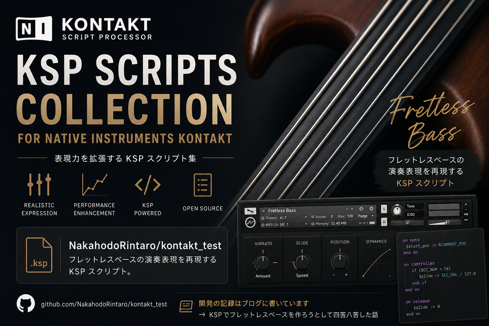

# kontakt_test

Native Instruments Kontakt 用の KSP (Kontakt Script Processor) スクリプト集。

開発の記録はブログに書いています → [KSPでフレットレスベースを作ろうとして四苦八苦した話](https://nakahodo.com/blog/posts/2026/04/25/kontakt-fretless-bass-ksp)

---

## scripts/FretlessBass.ksp

フレットレスベースの演奏表現を再現する KSP スクリプト。

### 機能

| 機能 | 説明 |
|---|---|
| **ポルタメント** | 直前のノートから現在のノートへピッチをグライド。Legato スイッチで常時 / レガート時のみ切替可能 |
| **スライドイン** | ノートに到達する前に数セミトーン離れた位置から滑らかに接近 |
| **ビブラート** | Vib.D ノブで深さ設定。Mod Wheel (CC1) を動かすとリアルタイムでビブラート深さを制御 |

### UI パラメータ

| パラメータ | 範囲 | デフォルト | 説明 |
|---|---|---|---|
| `Porta` | 0〜2000 ms | 150 ms | グライド時間。0 でオフ |
| `Legato` | ON / OFF | ON | ON = 前のノートを押しながら弾いたときのみポルタメント |
| `Slide` | ON / OFF | OFF | スライドイン有効/無効 |
| `Sld.R` | 1〜12 半音 | 3 | スライドする音程幅 |
| `Sld.T` | 10〜300 ms | 60 ms | スライド時間 |
| `Vib.D` | 0〜50 | 0 | 自動ビブラートの深さ（0 でオフ）|
| `Vib.R` | 10〜80 | 35 | ビブラートのレート |
| Mod Wheel (CC1) | — | — | ビブラート深さをリアルタイム制御（動かすと Vib.D より優先）|

### 使い方

> **注意**: このスクリプトは **インストゥルメントスクリプト** です。Multi Rack ヘッダーの KSP ボタン（multi script）ではなく、インストゥルメント内の Script Editor に読み込んでください。

1. Kontakt でインストゥルメントを開く
2. 左上の **レンチアイコン** をクリックしてインストゥルメントを展開
3. **Script Editor** タブを開く
4. `FretlessBass.ksp` の内容をペーストして **Apply** をクリック

### 推奨設定

| パラメータ | 推奨値 | 効果 |
|---|---|---|
| Porta | 100〜200 ms | ゆったりしたグライド |
| Legato | ON | フレーズの流れに応じて自然にグライド |
| Slide | ON / Sld.R 2〜4 | 弦を滑らせるフレットレスらしい入り方 |
| Vib.D | 20〜40 | 自然な揺れ |

---

## License

MIT
